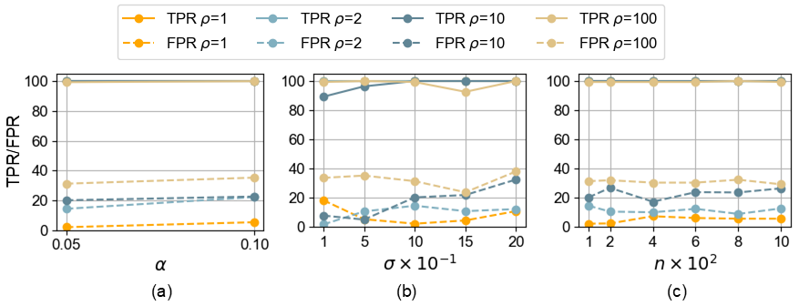
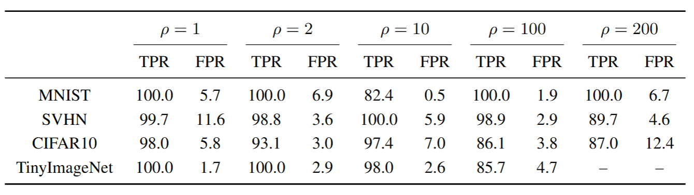

***Modified*** Figure 2: Relative frequency distribution of RPP for clean and poisoned samples on SVHN dataset with imbalance ratios: (a) $\rho = 1$, (a) $\mu$ = 0.9, $\rho = 10$  and (b) $\mu$ = 0.9, $\rho = 200$.

***Modified*** Figure 10: Relative frequency distribution of RPP for clean and poisoned samples on SVHN dataset with imbalance ratios: (a) $\mu$ = 0.9, $\rho = 2$  and (b) $\mu$ = 0.9, $\rho = 100$.

***Modified*** Figure 4: Performance comparison of RPP against Badnets backdoor attacks with perturbation magnitude 
$\|\delta\|_2 \geq 0.8$, measured by TPR and FPR across balanced datasets ($\rho = 1$), and varying 
imbalance ratios ($\rho = 2, 10, 100, 200$) with $n = 100$ for different $\alpha$ values on the CIFAR-10 dataset.

***Modified*** Table2: Comparison with SoTA defense methods on 4 kinds of imbalanced CIFAR-10 datasets ($\mu = 0.9$, $\rho = 2, 10, 100, 200$).

***Modified*** Figure 5: Performance comparison of RPP against Badnets backdoor attacks with perturbation magnitude 
$\|\delta\|_2 \geq 0.8$, measured by TPR and FPR across balanced dataset ($\rho = 1$), and varying 
imbalance ratios ($\rho = 2, 10, 100, 200$) for different $\sigma$ values with $\alpha = 0.05$ and 
$n = 100$ on MNIST, SVHN and CIFAR-10 datasets.

***Modified*** Figure 11: Performance of the RPP detection against Badnets backdoor attacks with perturbation magnitude 
$\|\delta\|_2 \geq 0.8$, measured by TPR and FPR across balanced dataset ($\rho = 1$), and varying 
imbalance ratios ($\mu = 0.9$, $\rho = 2, 10, 100$) on the TinyImageNet dataset.  (a) For different $\alpha$ values with $\sigma = 1.0$ and $n = 100$.  (b) For a range of $\sigma$ values with $\alpha = 0.05$ and $n = 100$.  (c) For various calibration sizes $n$ with $\alpha = 0.05$ and $\sigma = 1.0$.

***Modified*** Table4: Performance of the RPP detection against Badnets backdoor attacks with 
perturbation magnitude $\|\delta\|_2 \geq 0.8$, measured by TPR and FPR across balanced dataset 
($\rho = 1$) and varying imbalance ratios ($\mu = 0.9$, $\rho = 2, 10, 100, 200$) with 
$\alpha = 0.05$ on MNIST, SVHN, CIFAR-10, and TinyImageNet datasets.

***Modified*** Figure 12: Performance comparison of RPP against Badnets backdoor attacks with 
perturbation magnitude $\|\delta\|_2 \geq 0.8$, measured by TPR and FPR across balanced dataset ($\rho = 1$), 
and varying imbalance ratios ($\mu = 0.9$, $\rho = 2, 10, 100, 200$) for a range of $n$ with 
$\alpha = 0.05$ on MNIST, SVHN and CIFAR-10 datasets.

